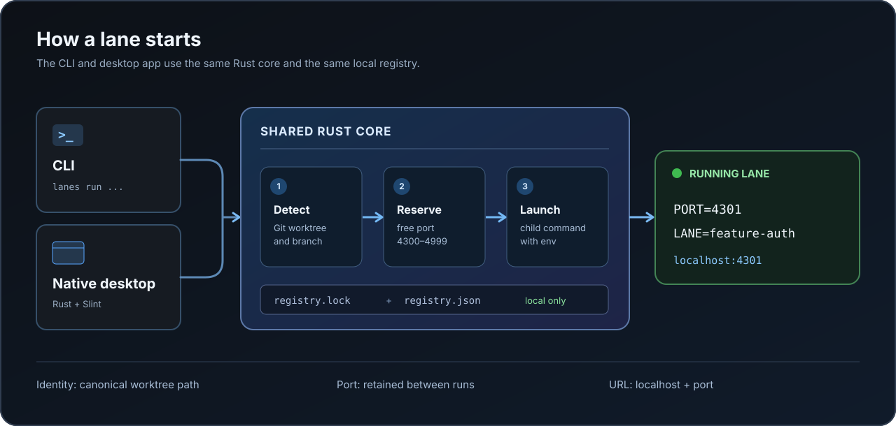

# Architecture



The workspace contains two Rust packages:

| Package | Responsibility |
| --- | --- |
| `crates/lanes-core` | Git discovery, lane registry, port allocation, process lifecycle, and the `lanes` CLI binary |
| `crates/lanes-desktop` | Slint window and desktop controls built on `lanes-core` |

The CLI and desktop app use the same registry and allocation functions. There is no background daemon. A command starts when you invoke `lanes run` or press **Run** in the desktop app.

## Worktree identity

Lanes calls Git to find the current top-level worktree path, the repository's common Git directory, and its branch. `git worktree list --porcelain` supplies the other worktrees. A detached HEAD is shown by its short commit ID.

The canonical worktree path identifies a lane. Renaming the branch keeps the same port as long as the worktree path stays the same; removing and recreating a worktree at a different path creates a new lane. The repository's common Git directory groups worktrees for display, while port reservations are global across the local registry.

## Port allocation

The registry reserves a port in `4300–4999` for each worktree path. A new lane takes the first unreserved port that Lanes can bind on IPv4 loopback (`127.0.0.1`). A stopped lane retains its reservation.

Before `run`, `env`, or `doctor` uses an idle lane, Lanes checks its port again. If another program now occupies it, Lanes chooses another available port and updates the registry. `status` discovers missing lanes but does not probe or repair every existing reservation. `lanes prune` releases entries for deleted worktree directories when no tracked process is running.

Port availability is a point-in-time check: Lanes releases its probe socket before it starts the child. Another process could claim the port in between. The application must bind `PORT` itself; Lanes cannot force a server to use it or guarantee that the server becomes ready.

## Registry and concurrency

By default, Lanes writes to the operating system's local user data directory under `Lanes`. `LANES_HOME` overrides that location for both clients. The directory contains:

```text
registry.json       worktree paths, branches, ports, commands, process IDs
registry.lock       interprocess lock for registry operations
lane-PORT.log       stdout/stderr for a desktop-launched command
```

Each registry operation takes an exclusive file lock. Changes are written to a temporary JSON file and renamed into place. The registry stays outside the Git repository; branches do not need generated config files.

## Process lifecycle

`lanes run` launches a child in the caller's current directory with inherited terminal input and output. The desktop app launches from the worktree root, redirects output to a log file, and waits for the child in a background thread. Both record the child PID and start time so a recycled PID is not mistaken for the old process.

`lanes stop` only acts on a process recorded for the current worktree. On Unix it signals the child tree for foreground runs or the isolated process group for desktop runs, then waits for the port to be released. On Windows it uses `taskkill /T /F`. After stopping, the port reservation remains in place.

## Boundaries

- One port and one tracked command per worktree.
- Local `http://localhost:PORT` URLs; no reverse proxy, custom hostname, TLS, or OAuth callback configuration.
- No `.env` rewriting. Only the launched child receives `PORT`, `LANE_PORT`, `LANE`, and `BASE_URL`.
- “Running” reflects the tracked process, not application health.
- The IPv4 loopback probe and child startup are not an atomic reservation.

These boundaries are useful when integrating a project: make its dev command read `PORT`, then verify the printed URL in a browser or with the project's own health endpoint.
