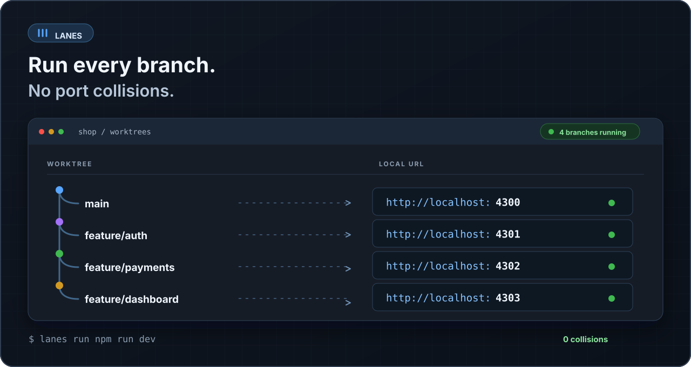

# Lanes: краткое руководство



Lanes назначает каждому Git worktree свой локальный порт и передаёт его запущенной команде через переменную `PORT`. Привязка сохраняется после остановки сервера. В проекте есть CLI и нативное приложение на Rust и Slint без WebView.

## Установка

Скачайте архив со страницы [последнего релиза](https://github.com/Kuli21232/lanes/releases/latest):

| ОС | Архив |
| --- | --- |
| Windows x64 | `lanes-windows-x64.zip` |
| Linux x64 | `lanes-linux-x64.tar.gz` |
| macOS на Apple Silicon | `lanes-macos-arm64.tar.gz` |

В каждом архиве есть CLI (`lanes` или `lanes.exe`) и приложение (`lanes-desktop` или `lanes-desktop.exe`). Распакуйте их и добавьте каталог в `PATH`. В PowerShell можно запускать файл из текущего каталога как `.\lanes.exe`.

Для сборки CLI из исходников нужны Git и Rust:

```sh
cargo install --git https://github.com/Kuli21232/lanes --package lanes-core --bin lanes
```

## Две ветки одновременно

В первом терминале откройте существующий репозиторий и запустите сервер:

```sh
cd my-app
lanes doctor npm
lanes run npm run dev
```

Во втором терминале создайте worktree и запустите ту же команду:

```sh
cd my-app
git worktree add -b feature/auth ../my-app-auth
cd ../my-app-auth
lanes run npm run dev
```

В третьем терминале выполните `lanes status` из любого из этих worktree. Вы увидите два разных URL. Номера портов зависят от уже занятых портов и предыдущих запусков.

Команда `lanes run` остаётся подключённой к процессу. Чтобы остановить сервер из другого терминала в том же worktree, выполните `lanes stop`. Чтобы посмотреть переменные без запуска сервера, выполните `lanes env`.

**Сервер должен читать `PORT`.** Lanes не меняет захардкоженный порт и не переписывает файлы `.env`. Для первой проверки используйте [готовый Node-пример](../../examples/branch-demo/README.md): ему не нужны npm-пакеты.

## Нативное приложение

Запустите `lanes-desktop` из архива. Выберите каталог внутри Git-репозитория через **Browse…**. Приложение покажет его worktree. В поле **Run command** укажите команду, например `npm run dev`:

- **Run** запускает команду в корне выбранного worktree.
- **Stop** останавливает процесс, который запустил Lanes.
- **Logs** показывает последние 64 КиБ вывода команды.
- **Open** открывает URL в обычном браузере.

Список и логи обновляются каждые четыре секунды. Если проект находится в подпапке, CLI можно вызвать из неё; приложение запускает команду из корня worktree, поэтому для него удобен скрипт в корне проекта.

## Что полезно знать

- Один worktree получает один порт из диапазона `4300–4999` и одну отслеживаемую команду.
- Статус «running» означает, что процесс ещё существует. Он не проверяет, отвечает ли HTTP-сервер.
- `lanes prune` освобождает записи удалённых worktree, если их процессы уже остановлены.
- Для работы нескольких сервисов, HTTPS, своих доменов и настройки OAuth пока нужна отдельная конфигурация проекта.

Подробности на английском: [начало работы](../getting-started.md), [команды CLI](../cli.md), [приложение](../desktop.md), [устройство проекта](../architecture.md), [решение проблем](../troubleshooting.md), [разработка](../development.md).
